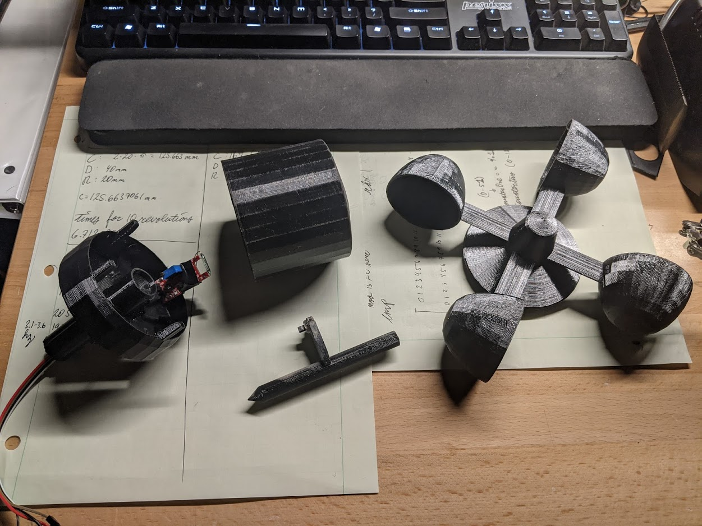
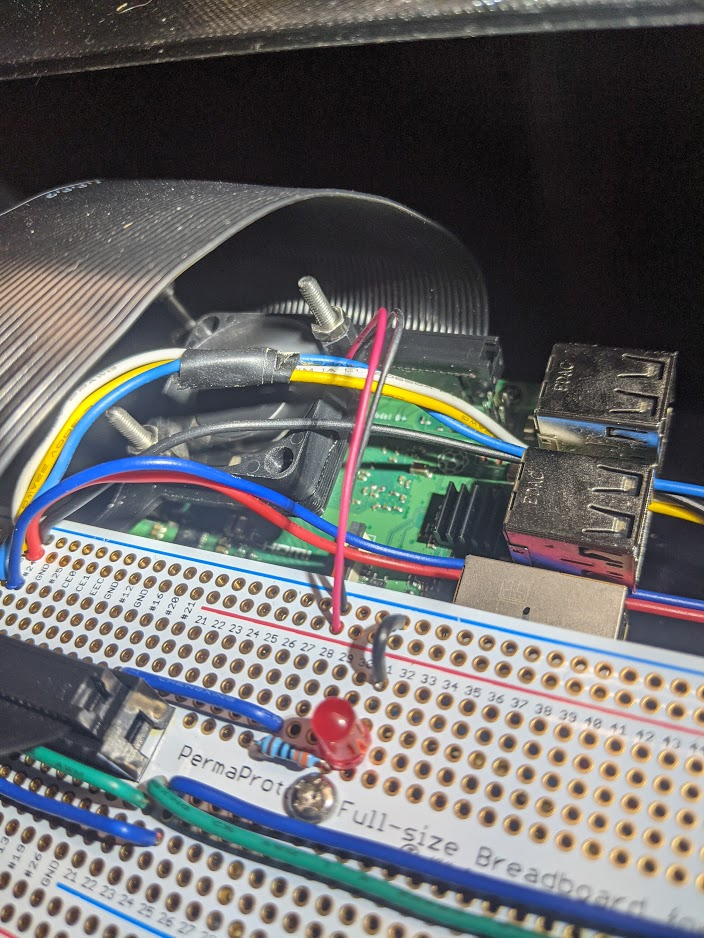
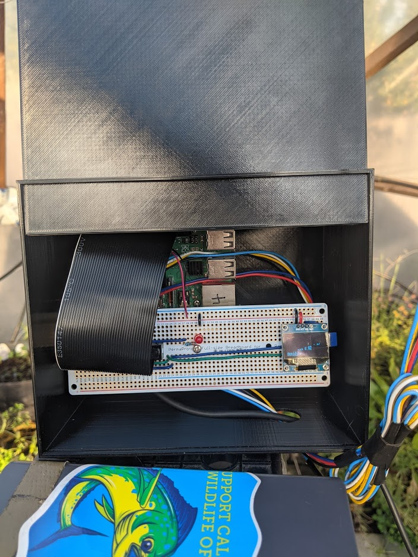

# WeatherStation
This is a simple weather station that will detect wind speed, temperature and humidity using a Raspberry Pi. 

The final program is in test7.py. There are also tests for the DHT11 sensor, minireed sensor and LED. This Anemometer has not been calibrated yet and it if the DHT11 sensor is placed in the housing with the reed sensor, temperatures may reported higher than actual conditions. To ensure that the whole assembly does not overheat and melt, reflective tape should be wrapped around the housing and on the anemometer or a heat resistant material should be used. 

Future add-ons will be to integrate a SQL database and a phone app to get historic data. It may be possible to integrate a barometer into the system to help an AI possibly forecast the weather. 

# 3D Printables

* __Anemometer__

I would like to give credit to this creator for making the Anemometer. 
https://www.thingiverse.com/thing:2875873 
Thank you. 



* __Fan Mount__

I would like to give credit to this creator for making the 30mm fan mount for the Raspberry Pi. 
https://www.thingiverse.com/thing:3768077
Thank you. 



* __Case__

Here is my box that houses the Raspbery Pi. It's a bit thin and should be kept out of the sun. My green house has killed many of my weather nodes. 
https://www.thingiverse.com/thing:4679757




# Dependencies
```
sudo apt-get update

sudo apt-get upgrade

sudo apt-get install python3-pip

sudo pip3 install --upgrade setuptools

sudo apt-get install -y python3 git python3-pip

sudo update-alternatives --install /usr/bin/python python $(which python2) 1

sudo update-alternatives --install /usr/bin/python python $(which python3) 2

sudo update-alternatives --config python

pip3 install RPI.GPIO

Settings:
sudo raspi-config
    Enable SPI
    Enable I2C

sudo apt-get install python-rpi.gpio python3-rpi.gpio

sudo apt-get update
sudo apt-get install build-essential python-pip python-dev python-smbus git
git clone https://github.com/adafruit/Adafruit_Python_GPIO.git
cd Adafruit_Python_GPIO
sudo python setup.py install

sudo pip3 install adafruit-blinka
sudo pip3 install adafruit-circuitpython-ssd1306

sudo apt-get install git
git clone https://github.com/adafruit/Adafruit_Python_SSD1306.git
cd Adafruit_Python_SSD1306
sudo python setup.py install

sudo apt-get install pigpiod

```


# Components 

*__Adafruit Perma-Proto 40-Pin Raspberry Pi Breadboard PCB Kit - with 2x20 Header__

https://www.adafruit.com/product/4354?gclid=Cj0KCQiA5bz-BRD-ARIsABjT4nhGM9xaGyWtDzdf_XIgJl1JtObSrcgb2qiX5TxGm9k6t9yMJNSTdk4aAgSFEALw_wcB

*__DHT11 Temperature Humidity Sensor Module Digital Temperature Humidity Sensor 3.3V-5V__

https://www.amazon.com/Temperature-Humidity-Digital-3-3V-5V-Raspberry/dp/B07WT2HJ4F/ref=sr_1_2?dchild=1&keywords=dht11+raspberry+pi&qid=1607494650&sr=8-2

*__I2C IIC 12864 128X64 Pixel OLED LCD Display__

https://www.amazon.com/gp/product/B076PNP2VD/ref=ppx_yo_dt_b_search_asin_title?ie=UTF8&psc=1&fpw=alm


*__KY-021 Mini Magnetic Reed__

https://www.amazon.com/KY-021-Magnetic-Arduino-Starters-Compatible/dp/B089FDXBSL/ref=sr_1_2?dchild=1&keywords=KY-021&qid=1607494785&sr=8-2

*__Magnet__

https://www.amazon.com/Deryun-Refrigerators-Magnets-Fridge-Whiteboard/dp/B0782VHLN8/ref=sr_1_18?crid=233DFTPH1FKZP&dchild=1&keywords=small+magnet&qid=1607494850&sprefix=small+magnet%2Caps%2C239&sr=8-18

*__Raspberry Pi 30mm fan and heat sinks__

https://www.amazon.com/Easycargo-Raspberry-Heatsink-Cooling-Cooler/dp/B07MK6L64S/ref=sr_1_10?dchild=1&keywords=30mm+fan+raspberry+pi+heatsink&qid=1607495047&sr=8-10